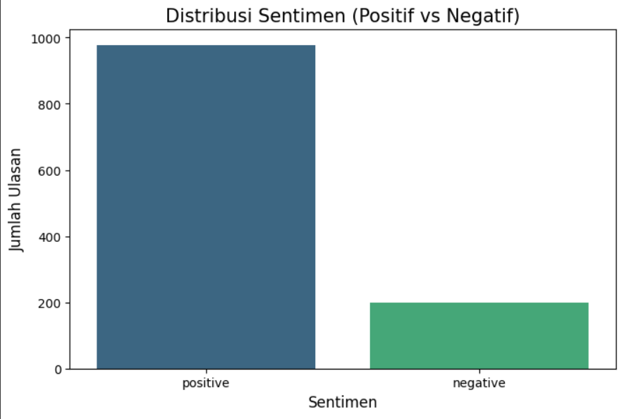
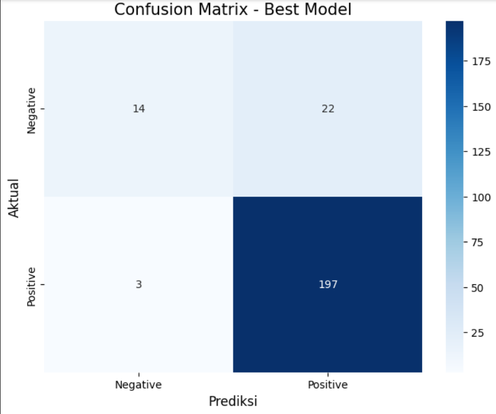
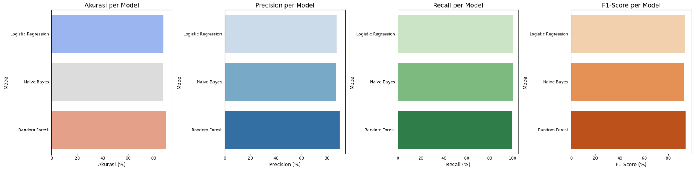
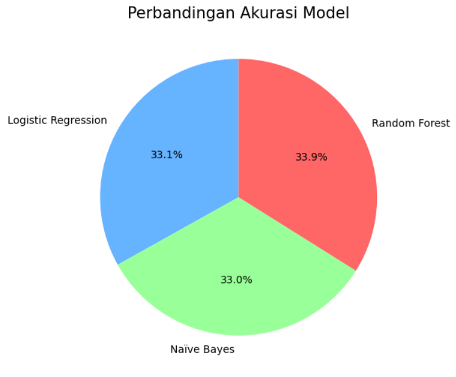

# Laporan Proyek Machine Learning - M Dicky Desriansyah

## Project Overview

### **Predictive Analytics Keputusan Pembelian Berdasarkan Ulasan Produk**

Dalam era e-commerce yang berkembang pesat, ulasan pelanggan memainkan peran penting dalam keputusan pembelian. Ulasan produk, yang sering kali mencerminkan pengalaman dan kepuasan pelanggan, dapat memberikan wawasan berharga bagi bisnis e-commerce untuk meningkatkan penjualan dan layanan mereka. Oleh karena itu, dengan menggunakan teknik **Predictive Analytics**, proyek ini bertujuan untuk memprediksi apakah suatu ulasan produk akan mempengaruhi keputusan pembelian berdasarkan sentimen ulasan tersebut.

Dataset yang digunakan dalam proyek ini adalah **Amazon Product Reviews Dataset** dari Kaggle, yang dapat diakses melalui tautan berikut:  
[Amazon Product Reviews Dataset](https://www.kaggle.com/datasets/yasserh/amazon-product-reviews-dataset)

**Referensi terkait**:  
- "Sentiment Analysis and Opinion Mining" oleh Bing Liu, seorang pakar dalam analisis sentimen.
- Riset sebelumnya menunjukkan bahwa ulasan pelanggan secara langsung mempengaruhi keputusan pembelian, dengan analisis sentimen yang memungkinkan untuk memahami sentimen pelanggan lebih dalam.

---

## Business Understanding

### **Problem Statements**
1. Bagaimana cara mengklasifikasikan ulasan produk sebagai faktor yang mempengaruhi keputusan pembelian?
2. Algoritma machine learning mana yang paling efektif dalam memprediksi sentimen ulasan produk?

### **Goals**
- Mengembangkan model machine learning yang dapat mengklasifikasikan ulasan produk sebagai **positif** atau **negatif** berdasarkan sentimen yang terkandung di dalamnya.
- Mengevaluasi berbagai algoritma machine learning untuk menentukan model terbaik berdasarkan metrik evaluasi seperti **accuracy**, **precision**, **recall**, dan **F1-score**.

### **Solution Statement**
Untuk mencapai tujuan ini, dilakukan pendekatan berikut:
1. Menggunakan **TF-IDF** untuk mengubah teks ulasan menjadi representasi numerik yang dapat diproses oleh algoritma machine learning.
2. Mencoba beberapa model **machine learning** seperti **Logistic Regression**, **Naïve Bayes**, dan **Random Forest** untuk menentukan algoritma yang paling efektif dalam memprediksi sentimen ulasan.
3. Melakukan **hyperparameter tuning** pada model terbaik untuk meningkatkan performa prediksi, dengan memanfaatkan teknik seperti **Grid Search**.

---

## Data Understanding

Dataset yang digunakan dalam proyek ini adalah **Amazon Product Reviews Dataset**, yang berisi **194.439 ulasan** produk Amazon. Dataset ini terdiri dari beberapa fitur penting yang digunakan dalam analisis sentimen, antara lain:

- `reviews.text`: Berisi teks ulasan yang ditulis oleh pelanggan.
- `reviews.rating`: Menunjukkan skor rating yang diberikan oleh pelanggan, dengan skala 1 hingga 5 bintang.
- `reviews.doRecommend`: Menunjukkan apakah pelanggan merekomendasikan produk tersebut.
- `sentiment`: Label sentimen yang diturunkan dari `reviews.rating`, di mana ulasan dikategorikan sebagai **"Positif"** jika rating lebih dari 3, dan **"Negatif"** jika rating 3 atau kurang.



### **Exploratory Data Analysis (EDA)**
Beberapa visualisasi awal menunjukkan distribusi ulasan berdasarkan rating dan sentimen, serta frekuensi kata-kata yang muncul dalam ulasan. Hasil EDA ini memberikan gambaran tentang keseimbangan kelas dan pola teks dalam dataset.



Tautan ke dataset: [Amazon Product Reviews Dataset](https://www.kaggle.com/datasets/yasserh/amazon-product-reviews-dataset)

---

## Data Preparation

Tahap persiapan data merupakan langkah penting untuk memastikan data siap digunakan dalam proses pemodelan. Berikut adalah beberapa teknik yang diterapkan:

### **Data Cleaning**
- Menghapus baris yang memiliki nilai kosong pada kolom `reviews.text` dan `reviews.rating` untuk memastikan kualitas data.

### **Text Preprocessing**
- **Case Folding**: Semua teks diubah menjadi huruf kecil untuk menghindari perbedaan kata yang hanya disebabkan oleh kapitalisasi.
- **Membersihkan Tanda Baca**: Menghapus semua tanda baca dari teks menggunakan ekspresi regular.
- **Tokenisasi**: Memecah teks menjadi kata-kata individual menggunakan `word_tokenize`.
- **Stop Words Removal**: Menghapus kata-kata umum yang tidak berkontribusi pada makna, seperti "the", "is", "and".
- **Stemming**: Mengubah kata-kata menjadi bentuk dasarnya menggunakan **Porter Stemmer**.

### **Feature Engineering**
- **TF-IDF Vectorization**: Mengubah teks yang telah diproses menjadi representasi numerik menggunakan **TF-IDF** untuk menangkap pentingnya kata dalam teks.

### **Data Splitting**
- Dataset dibagi menjadi dua bagian: **80% untuk data training** dan **20% untuk data testing**.

---

## Modeling

Pada tahap ini, tiga model machine learning diuji untuk memprediksi sentimen ulasan:

### **Models**:
- **Logistic Regression**: Model linier yang sering digunakan untuk masalah klasifikasi biner.
- **Naive Bayes (MultinomialNB)**: Model probabilistik yang didasarkan pada teorema Bayes dan sering digunakan untuk klasifikasi teks.
- **Random Forest**: Model ensemble yang menggunakan beberapa pohon keputusan untuk membuat prediksi.

### **Model Improvement**:
- Model terbaik, **Logistic Regression**, dievaluasi lebih lanjut dengan **hyperparameter tuning** untuk meningkatkan performa menggunakan teknik **Grid Search**.

---

## Evaluation

Beberapa metrik evaluasi digunakan untuk mengukur kinerja model:

### **Metrik Evaluasi**:
- **Accuracy**: Persentase prediksi yang benar dari total prediksi.
- **Precision**: Proporsi prediksi positif yang benar dari semua prediksi positif.
- **Recall**: Proporsi prediksi positif yang benar dari semua data positif yang sebenarnya.
- **F1-Score**: Rata-rata harmonik antara precision dan recall.

### **Hasil Evaluasi**:
| Model                | Accuracy | Precision | Recall  | F1-Score |
|----------------------|----------|-----------|---------|----------|
| Logistic Regression   | 87.7%    | 87.3%     | 100%    | 93.2%    |
| Naive Bayes           | 87.2%    | 86.9%     | 100%    | 93%      |
| Random Forest         | 89.8%    | 89.6%     | 99.5%   | 94.3%    |



Dari hasil evaluasi, **Random Forest** menunjukkan performa terbaik dengan akurasi **89.8%** dan F1-Score tertinggi **94.3%**. Model ini dipilih sebagai model terbaik dalam proyek ini.


---

## Deployment

### **Model Deployment**:
Model terbaik, yaitu **Random Forest**, telah dideploy sebagai REST API menggunakan **Flask**. API ini memungkinkan aplikasi lain untuk mengakses dan menggunakan model untuk prediksi sentimen.

### **API Endpoint**:
- **Endpoint**: `/predict`
- **Request**: 
```json
POST /predict
{
  "review": "Produk ini sangat bagus!"
}
```
- **Response**:
```json
{
  "review": "Produk ini sangat bagus!",
  "sentiment": "positive"
}
```

### **Deployment Options**:
- **Heroku**: Platform cloud yang mudah digunakan untuk deployment aplikasi sederhana.
- **AWS**: Platform cloud dengan berbagai layanan untuk deployment dan skalabilitas aplikasi.
- **Google Cloud Run**: Platform serverless untuk deployment dan eksekusi container.

### **Penanganan Error**:
- **Validasi Input**: API memastikan input teks ulasan sesuai format yang diinginkan.
- **Logging**: Semua request dan error dicatat untuk memudahkan debugging.

---

## Kesimpulan

Proyek ini berhasil membangun sistem analisis sentimen untuk ulasan produk Amazon menggunakan teknik Machine Learning. Model terbaik yang digunakan adalah **Random Forest**, dengan akurasi **89.8%**. Sistem ini memberikan wawasan berharga bagi bisnis e-commerce untuk memahami sentimen pelanggan.

### **Pengembangan Masa Mendatang**:
- Eksplorasi model **Deep Learning** dan **Transformer-based models** seperti **BERT** untuk meningkatkan performa prediksi.

---

## Tantangan yang Dihadapi

Beberapa tantangan yang dihadapi dalam proyek ini meliputi:
- **Kualitas Data**: Teks yang tidak relevan atau informal sulit diproses dengan baik.
- **Ketidakseimbangan Kelas**: Data ulasan positif lebih banyak dibandingkan ulasan negatif.
- **Keterbatasan Sumber Daya**: Penggunaan model Deep Learning membutuhkan banyak data dan daya komputasi.

---

🚀 **Proyek ini siap untuk tahap implementasi lebih lanjut!**

- **Real-time sentiment analysis** dapat meningkatkan pengalaman pelanggan.
- Sistem ini dapat diintegrasikan ke dalam **sistem rekomendasi produk** untuk bisnis e-commerce.

---
